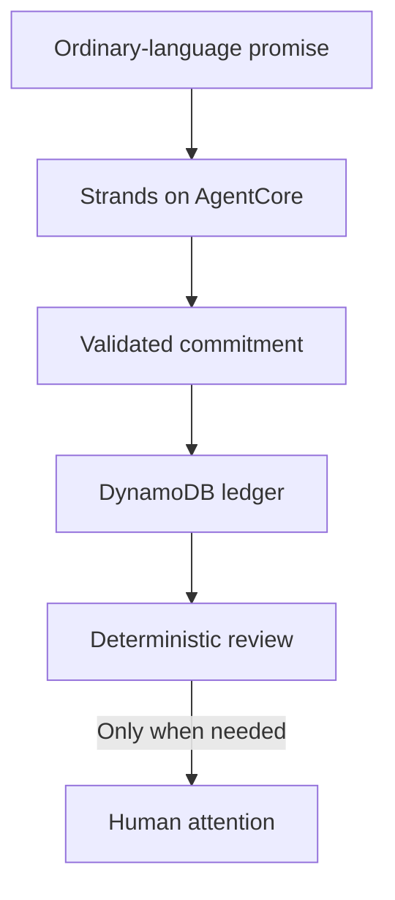

# Loose Ends

**A quiet memory for promises.**

Loose Ends captures commitments in ordinary language, keeps an exact ledger of them, and interrupts only when a person genuinely needs to act, clarify, decide, approve, send, or pay.

> “I promised Mom I’d call the dentist tomorrow.”

That becomes a structured loose end, waits without nagging, and returns when the dentist call actually needs the user.

## The first vertical slice

1. A user states a real commitment.
2. A Strands agent converts it into validated fields and calls one tool: `capture_commitment`.
3. The commitment is stored locally during development or in DynamoDB when deployed.
4. A deterministic reviewer returns only commitments that need human attention.

The language model interprets the sentence. It does **not** decide whether a stored record is due, completed, or safe to ignore.



## Current boundaries

- Loose Ends may remember, organize, research, or prepare without interrupting.
- It must ask before external side effects such as sending, buying, booking, approving, or making a consequential decision.
- It never invents a deadline. Missing timing becomes a clarification, not a confident guess.
- DynamoDB is the source of truth for commitments. AgentCore Memory may later hold conversational context, but semantic memory is not an obligation ledger.
- Alexa is a later voice adapter, not part of v0.

## Repository layout

```text
agentcore/                 AgentCore Runtime project configuration
app/LooseEnds/             Python agent, domain logic, stores, and tests
docs/                      Architecture and build sequence
infra/template.yaml        DynamoDB table and least-privilege access policy
```

## Run the domain tests

The tests exercise capture, persistence, and the human-attention policy without calling a model or AWS.

```bash
cd app/LooseEnds
python -m venv .venv
source .venv/bin/activate
pip install -e .
python -m unittest discover -s tests -v
```

On Windows PowerShell, activate with `.venv\Scripts\Activate.ps1`.

## Run the agent locally

Prerequisites: Python 3.12+, Node.js 20+, configured AWS credentials, and access to the selected Amazon Bedrock model.

```bash
npm install -g @aws/agentcore
cp agentcore/aws-targets.example.json agentcore/aws-targets.json
cp .env.example agentcore/.env.local
```

Replace the placeholder AWS account in `agentcore/aws-targets.json`, then start the local inspector:

```bash
agentcore dev
```

Capture the demo commitment from a second terminal:

```bash
agentcore dev "I promised Mom I would call the dentist tomorrow"
```

Review what needs human attention:

```bash
curl -sS http://localhost:8080/invocations \
  -H "Content-Type: application/json" \
  -d '{"operation":"review","actor_id":"local-user"}'
```

The review operation is deterministic and does not spend a model call.

## Provision the exact ledger

```bash
aws cloudformation deploy \
  --template-file infra/template.yaml \
  --stack-name loose-ends-data \
  --capabilities CAPABILITY_NAMED_IAM
```

Read the stack outputs, then:

1. Set `LOOSE_ENDS_TABLE` in the runtime environment.
2. Add the emitted `CommitmentsPolicyArn` to the runtime’s `additionalPolicies` in `agentcore/agentcore.json`.
3. Run `agentcore deploy --dry-run`, then `agentcore deploy`.

Once deployed, pass the actor through AgentCore identity rather than the payload:

```bash
agentcore invoke \
  --user-id local-user \
  --session-id loose-ends-demo-session-0000000001 \
  "I promised Mom I would call the dentist tomorrow"
```

The deployed app intentionally refuses to fall back to a local file when `LOOSE_ENDS_TABLE` is absent.

## What comes next

See [the build sequence](docs/ROADMAP.md). The next meaningful milestone is an AWS-deployed end-to-end pass: capture a commitment through AgentCore, verify the DynamoDB record, then review it without generating noise.
