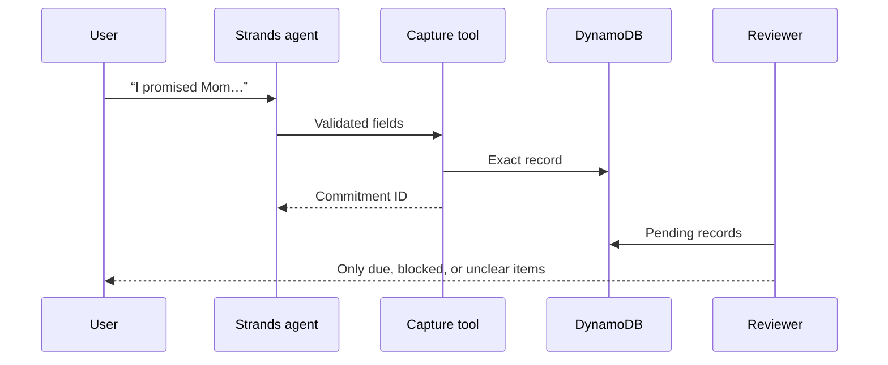

# Promise Pocket architecture

Promise Pocket separates language interpretation from commitment truth and from interruption policy.

## Components

| Component | Responsibility | Trust level |
| --- | --- | --- |
| Strands agent | Recognize and normalize a commitment from ordinary language | Proposes fields only |
| `capture_commitment` | Bind trusted actor context, validate fields, and write one record | Enforced boundary |
| DynamoDB | Exact commitment status, deadline, and audit record | Source of truth |
| Reviewer | Decide whether human attention is currently necessary | Deterministic |
| Attention adapter | Deliver a question or due item | Later milestone |
| AgentCore Memory | Preserve scoped conversational context | Optional; never authoritative for commitment state |

## Data flow

## Commitment record

The initial record preserves:

- stable commitment ID and actor ID;
- faithful summary and original user wording;
- absolute, offset-aware deadline when known;
- explicitly involved people;
- whether a person must act;
- missing information and blockers;
- status and timestamps.

The model may suggest commitment fields. The tool obtains `actor_id` from Strands invocation state, creates IDs and timestamps in code, validates datetimes, and rejects extra fields.

## Human-attention policy

A pending commitment is surfaced only when one of these is true:

1. a material detail needs clarification;
2. safe autonomous progress is blocked;
3. the commitment is due and requires personal action.

A future commitment is silent. A due item marked as safe agent work is also silent unless it becomes blocked. Later execution milestones must add an explicit approval gate before any external side effect.

## Storage decision

DynamoDB is the commitment ledger because obligation state must be exact, queryable, and updateable. AgentCore Memory is well suited to conversational continuity and extracted context, but semantic retrieval must not determine whether a deadline exists or a promise was completed.

Local JSON storage exists only for development. The settings layer fails closed outside `LOCAL_DEV=1` when no DynamoDB table is configured.

## Identity boundary

The local demo accepts `actor_id` in the invocation payload. That fallback is enabled only under `LOCAL_DEV=1`. Deployed invocations bind the actor to AgentCore’s authenticated `context.user_id`; identity is never selectable by the language model or untrusted prompt text.
